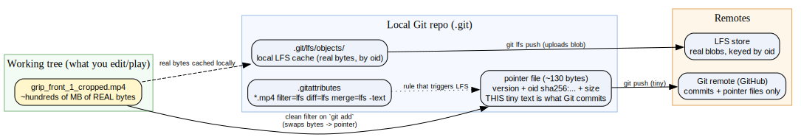
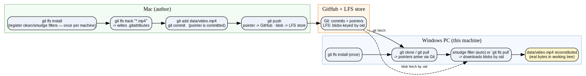

# Dev Environment & Data Flow — WSL2, Git-LFS, and asset storage

> **Domain:** Project infrastructure — where code runs, how large data moves, how docs/assets are stored
> **Status:** active · **Last updated:** 2026-06-08 · **Maintainer:** Claude + Thomas
> **Related:** [Windows GPU architecture](windows_gpu_architecture_notes.md) · [SAM-Body4D inference pipeline](sam_body4d_inference_pipeline.md)
> **Wiki-link demo (Obsidian/Foam only):** [[windows_gpu_architecture_notes]] · [[sam_body4d_inference_pipeline]]
>
> **Verification legend:** `[V]` verbatim/observed · `[D]` documented by cited source · `[I]` inference · `[M]` verify on-machine.

## TL;DR
Code runs on a **Windows 11 + RTX 5070 Ti** PC. The CUDA/Linux pipeline executes in **WSL2 Ubuntu**
(GPU via paravirtualization — see [GPU notes](windows_gpu_architecture_notes.md)); **Blender** runs native
on Windows. Large inputs (the source video) ride **Git-LFS**; our knowledge-doc **media** is stored
**locally and backed up to a GCS bucket** (not committed to git). Documentation lives in `docs/knowledge/`.

## Where things run
| Component | Environment | Notes |
|---|---|---|
| SAM-Body4D pipeline (`decord`, `pyrender`, `detectron2`) | **WSL2 Ubuntu 24.04** | Linux-only deps; GPU via host-driver passthrough `[D]` |
| Blender (rig build, render) | **native Windows** | Talks to the NVIDIA driver directly, no VM hop `[I]` |
| Claude Code | TBD (Windows vs in-WSL2) | See plan's orchestration decision `[I]` |

## Large file transport — Git-LFS
Git stores every version of a file in full; binaries bloat history and slow clones, so videos/weights use
**Git Large File Storage**: git commits a tiny text **pointer**; the real bytes live in a separate LFS store.

**Diagram**
- **source:** [LFS_A_object_model.dot](assets/devenv/LFS_A_object_model.dot)
- **render:** [LFS_A_object_model.svg](assets/devenv/LFS_A_object_model.svg)

Cross-machine flow (Mac authored the clip → this PC pulls it):

**Diagram**
- **source:** [LFS_B_workflow.dot](assets/devenv/LFS_B_workflow.dot)
- **render:** [LFS_B_workflow.svg](assets/devenv/LFS_B_workflow.svg)

Practical rules: `git lfs install` **before** cloning; `.gitattributes` declares `*.mp4 filter=lfs`; a stub
(~130-byte text file starting `version https://git-lfs…`) means the blob wasn't fetched → `git lfs pull`. `[D]`

## Asset storage policy (knowledge-doc media)
Decision for this project (local-first, single PC):
- **All doc media lives locally** in `docs/knowledge/assets/<topic>/`; docs link with **local relative paths**. `[I]`
- **Git tracks** small text-derived images (graphviz `.dot` + their PNGs). **Large/photographic media**
  (3D renders, UI screenshots, video) is **git-ignored** (kept out of the repo). `[I]`
- **GCS is a full backup mirror**, not the link target: `gcloud storage rsync docs/knowledge/assets
  gs://<bucket>/assets` copies everything (incl. git-ignored large files). `[I]`
- Consequence: git-ignored large media renders **only locally** (Obsidian/VS Code), not on github.com; the
  GCS mirror is the durability/restore path. Per-image escape hatch: link a specific image to its GCS public
  URL if GitHub rendering is needed. `[I]`

## Documentation system (this folder)
- `docs/knowledge/*.md` — one file per domain; cross-linked; standard markdown links for portability.
- `docs/knowledge/assets/<topic>/` — diagrams (source + PNG) and media.
- `docs/knowledge/README.md` — index; `_TEMPLATE.md` — the doc template + verification legend.
- Maintenance: a `knowledge-curator` skill (capability) + a CLAUDE.md standing instruction (trigger) +
  deterministic render/index/link-check script. Auto-memory feeds incidental learnings into these docs. `[I]`

## Open questions / to verify `[M]`
- Provision the GCS bucket + decide public-read vs private (project info pending from user).
- Confirm the `.gitignore` patterns for large media (e.g., `*.mp4`, `assets/**/*.mov`, hi-res renders).
- Decide where Claude Code runs (Windows vs WSL2) and run it from the `sam-body4d` repo for correct memory scope.

## Sources
- Git-LFS · retrieved 2026-06-08 — [https://git-lfs.com/](https://git-lfs.com/)
- GitHub — Managing large files · retrieved 2026-06-08 — [https://docs.github.com/en/repositories/working-with-files/managing-large-files](https://docs.github.com/en/repositories/working-with-files/managing-large-files)
- Google Cloud — gcloud storage reference · retrieved 2026-06-08 — [https://cloud.google.com/sdk/gcloud/reference/storage](https://cloud.google.com/sdk/gcloud/reference/storage)
- Claude Code — Memory · retrieved 2026-06-08 — [https://code.claude.com/docs/en/memory](https://code.claude.com/docs/en/memory)
- Claude Code — Skills · retrieved 2026-06-08 — [https://code.claude.com/docs/en/skills](https://code.claude.com/docs/en/skills)

## Changelog
- 2026-06-08 — Initial draft. Documents the WSL2/Blender split, Git-LFS transport (figures from the LFS
  explainer), and the local-media + GCS-backup asset policy agreed with the user.
- 2026-06-08 — Normalized Sources to full-URL link text per convention.
