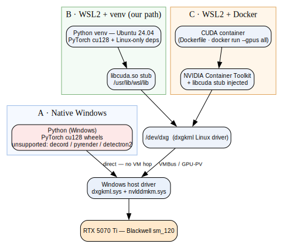

# GPU Model-Runtime Architectures on Windows — native vs WSL2 vs Docker

> **Domain:** Ways to run CUDA/PyTorch model workloads on this Windows 11 + RTX 5070 Ti machine
> **Status:** active · **Last updated:** 2026-06-08 · **Maintainer:** Claude + Thomas
> **Related:** [Windows GPU architecture](windows_gpu_architecture_notes.md) (the shared driver stack) · [Dev environment & data flow](dev_environment_and_data.md)
> **Wiki-link demo (Obsidian/Foam only):** [[windows_gpu_architecture_notes]] · [[dev_environment_and_data]]
>
> **Verification legend:** `[V]` verbatim/observed · `[D]` documented (cited) · `[I]` inference · `[M]` verify on-machine.

## TL;DR
There are three practical ways to run a CUDA model workload on this machine — **(A) native Windows**,
**(B) WSL2 + venv**, **(C) WSL2 + Docker** — and **all three bottom out on the same Windows host NVIDIA
driver via GPU Paravirtualization** (the on-die compute is identical; see [the driver-stack
doc](windows_gpu_architecture_notes.md)). The differentiator is the *environment* around the GPU call.
For **SAM-Body4D specifically, native Windows is out** (Linux-only deps), so it's **B vs C**; we use **B
(WSL2 + venv)** for simplicity, with **C (Docker)** as the reproducible alternative.

## The three approaches at a glance

**Diagram**
- **source:** [runtimes_compare.dot](assets/gpu/runtimes_compare.dot)
- **render:** [runtimes_compare.svg](assets/gpu/runtimes_compare.svg)

## Shared foundation (all approaches)
Whatever the environment, GPU work reaches the silicon through the **single Windows host driver**
(`nvlddmkm.sys`); inside any WSL2 environment the driver is exposed as the **`libcuda.so` stub** and calls
are paravirtualized over `/dev/dxg` → VMBus → host. Hard rule everywhere: **never install an NVIDIA Linux
driver inside WSL2.** `[V]` — [https://docs.nvidia.com/cuda/wsl-user-guide/index.html](https://docs.nvidia.com/cuda/wsl-user-guide/index.html). Full mechanism: [Windows GPU architecture](windows_gpu_architecture_notes.md).

## A. Native Windows (CUDA on Windows directly)
- **What:** run Python + PyTorch **Windows** `cu128` wheels straight on Windows; the app talks to
  `nvlddmkm.sys` directly — **no VM hop**, lowest latency. `[I]`
- **Driver/toolkit:** install the Windows NVIDIA driver (already present, 591.74); PyTorch ships its own
  CUDA runtime, so no separate CUDA toolkit needed unless compiling extensions. `[D]`
- **Why it's out for SAM-Body4D:** the pipeline needs **`decord`, `pyrender`, `detectron2`**, which lack
  usable native-Windows support (`decord` has no Windows/mac wheels; `pyrender`/`detectron2` are
  Linux-first). `[D]` — repo `pyproject.toml` / `HANDOFF.md`.
- **Good for:** pure-PyTorch Windows tooling, quick GPU sanity checks, GUI apps (Blender uses this path).

## B. WSL2 + venv  (our path)  `[V]` verified on-machine 2026-06-08
- **What:** a Python **venv inside Ubuntu 24.04 (WSL2)**; `pip install torch …/cu128` + the Linux-only
  deps; GPU via GPU-PV passthrough. Verified here: Ubuntu 24.04.4, Python 3.12.3, RTX 5070 Ti visible via
  `nvidia-smi -L`, `libcuda.so` stub present. `[V]`
- **Low-level:** ATen → `libcuda.so` (stub) → `/dev/dxg` → VMBus → host driver → GPU.
- **Pros:** native Linux deps "just work"; minimal layers; fast to stand up; Claude Code sandboxing
  available if run inside WSL2. `[D]`
- **Cons:** env lives in one distro (less portable than an image); per-call VMBus latency (negligible at
  `batch_size ≥ 16`). `[I]`

## C. WSL2 + Docker (CUDA container)
- **What:** run the workload in a **CUDA Docker image** (this repo has a `Dockerfile`) with
  `docker run --gpus all`. Two sub-variants:
  1. **Docker Desktop (WSL2 backend)** — GPU support requires the WSL2 backend + GPU-PV drivers. `[V]` —
     [https://docs.docker.com/desktop/features/gpu/](https://docs.docker.com/desktop/features/gpu/).
  2. **Docker engine *inside* WSL2** — install docker + NVIDIA Container Toolkit directly in the distro
     (no Docker Desktop). This is how the sibling *cobot* project runs its SimMachine. `[I]`
- **Low-level:** the **NVIDIA Container Toolkit** (min v2.6.0 / libnvidia-container 1.5.1+) injects the
  host driver libraries (and the `/dev/dxg` device) into the container so the same GPU-PV path works from
  inside it. On WSL2 **only `--gpus all` is supported** — you cannot select GPUs by index. `[V]` —
  [https://docs.nvidia.com/cuda/wsl-user-guide/index.html](https://docs.nvidia.com/cuda/wsl-user-guide/index.html); toolkit: [https://docs.nvidia.com/datacenter/cloud-native/container-toolkit/latest/install-guide.html](https://docs.nvidia.com/datacenter/cloud-native/container-toolkit/latest/install-guide.html). The `/dev/dxg` injection specifics are inferred. `[I]`
- **Validate GPU in a container:** `docker run --rm --gpus all nvcr.io/nvidia/k8s/cuda-sample:nbody nbody -gpu -benchmark`. `[V]`
- **Pros:** reproducible/pinned env, portable image, isolates the messy deps; matches the repo's existing
  `Dockerfile`. **Cons:** more setup/layers; image build time; Claude Code's Bash sandbox is incompatible
  with `docker` (exclude `docker *`). `[D]` — [https://code.claude.com/docs/en/sandboxing](https://code.claude.com/docs/en/sandboxing).

## D. Other options (for completeness)
- **Bare-metal Linux (dual-boot):** max performance, no virtualization layer, native everything — but a
  separate OS install; not this machine's setup. `[I]`
- **Cloud GPU (e.g., HF Space L40S):** offload entirely; the project's `troutmoose/sam-body4d` Space is the
  paused/billed example. Good for big runs, but remote + costs + checkpoint provisioning. `[D]` — repo `CLAUDE.md`.

## Comparison
| Dimension | A · Native Windows | B · WSL2 + venv | C · WSL2 + Docker |
|---|---|---|---|
| GPU path | direct to host driver | GPU-PV via `/dev/dxg` | GPU-PV via container toolkit |
| Linux-only deps (decord/pyrender/detectron2) | ❌ | ✅ | ✅ |
| Reproducibility | low | medium | **high (image)** |
| Overhead / layers | lowest | low (VMBus hop) | moderate |
| Setup effort | low | low | higher |
| Claude Code sandbox | ❌ (native Win) | ✅ | ⚠️ `docker` excluded |
| Fit for SAM-Body4D | ✗ | **✓ (current)** | ✓ (alt) |

## Recommendation
**B (WSL2 + venv)** for this project now — verified working, fewest moving parts, native Linux deps. Move
to **C (Docker)** if/when we need a reproducible, portable, or shareable environment (the `Dockerfile` is
already in-repo). **A** is only for native-Windows/GUI tasks (e.g., Blender). `[I]`

## Open questions / to verify `[M]`
- Confirm `pip install torch …/cu128` in the venv reports `get_device_capability()==(12,0)` (Stage 1).
- If we try Docker: confirm the NVIDIA Container Toolkit path on this machine and the `nbody` GPU test.
- Measure native-Windows vs WSL2 throughput delta for a representative batch (likely negligible).

## Sources
- NVIDIA — CUDA on WSL User Guide (driver stub, containers, `--gpus all`) · retrieved 2026-06-08 — [https://docs.nvidia.com/cuda/wsl-user-guide/index.html](https://docs.nvidia.com/cuda/wsl-user-guide/index.html)
- Docker — GPU support in Docker Desktop for Windows · retrieved 2026-06-08 — [https://docs.docker.com/desktop/features/gpu/](https://docs.docker.com/desktop/features/gpu/)
- NVIDIA — Container Toolkit install guide · retrieved 2026-06-08 — [https://docs.nvidia.com/datacenter/cloud-native/container-toolkit/latest/install-guide.html](https://docs.nvidia.com/datacenter/cloud-native/container-toolkit/latest/install-guide.html)
- Microsoft — Enable NVIDIA CUDA on WSL 2 · retrieved 2026-06-08 — [https://learn.microsoft.com/en-us/windows/ai/directml/gpu-cuda-in-wsl](https://learn.microsoft.com/en-us/windows/ai/directml/gpu-cuda-in-wsl)

## Changelog
- 2026-06-08 — Initial draft. Compares native-Windows / WSL2-venv / WSL2-Docker runtimes with a converging
  architecture diagram; WSL2-venv path verified on-machine. Cross-links the driver-stack doc.
