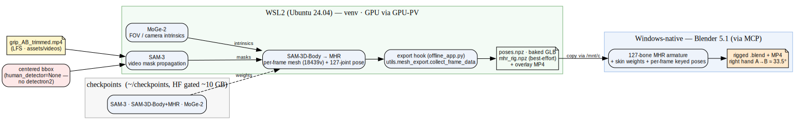
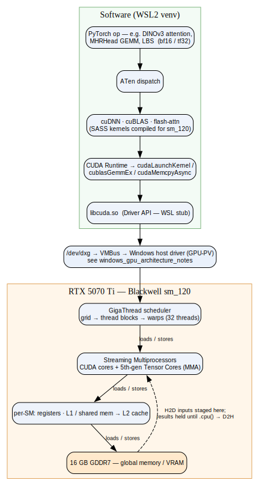

# Technical Design Document — Grip 4D Pipeline (Path B: WSL2 + venv)

> **Domain:** End-to-end system design for recovering a rigged 4D grip animation from video on this Windows + RTX 5070 Ti machine
> **Status:** active · **Last updated:** 2026-06-08 · **Maintainer:** Claude + Thomas
> **Related:** [GPU runtimes (native/WSL2/Docker)](gpu_runtimes_windows.md) · [Windows GPU architecture](windows_gpu_architecture_notes.md) · [SAM-Body4D pipeline](sam_body4d_inference_pipeline.md) · [Dev environment & data flow](dev_environment_and_data.md)
> **Wiki-link demo (Obsidian/Foam only):** [[gpu_runtimes_windows]] · [[sam_body4d_inference_pipeline]]
>
> **Verification legend:** `[V]` verbatim/observed · `[D]` documented (cited) · `[I]` inference · `[M]` verify on-machine.

## 1. Purpose & goal
Recover a **clean, rigged, editable Blender 4D animation** of a golfer's right-hand grip change (grip A→B)
by running the real video through the **SAM-Body4D** pipeline locally, then retargeting the per-frame MHR
mesh + 127-joint pose onto a Blender armature. End-to-end sanity check: **right hand rotates ≈ 33.5°
relative to the left** between A and B (previously validated). `[D]` (project `HANDOFF.md`).

## 2. System architecture

**Diagram**
- **source:** [pipeline_system.dot](assets/pipeline/pipeline_system.dot)
- **render:** [pipeline_system.svg](assets/pipeline/pipeline_system.svg)

**Environment split (Path B):** the ML pipeline runs in **WSL2 (Ubuntu 24.04, venv)** because its deps
(`decord`, `pyrender`, `detectron2`) are Linux-only; **Blender runs native on Windows** and is driven over
MCP. The GPU is shared — both reach the RTX 5070 Ti through the single Windows host driver (WSL2 via
GPU-PV). Rationale + alternatives: [GPU runtimes](gpu_runtimes_windows.md). `[V]` (env verified on-machine 2026-06-08).

**Stages** (detail in [SAM-Body4D pipeline](sam_body4d_inference_pipeline.md)):
1. **SAM-3** — video mask propagation, seeded by an initial bbox.
2. **MoGe-2** — FOV / camera intrinsics.
3. **SAM-3D-Body → MHR** — per-frame mesh (18,439 verts) + 127-joint pose (`pred_joint_coords`, `pred_global_rots`).
4. **Export hook (new)** — accumulate per-frame data → `poses.npz` + baked-vertex GLB (+ best-effort `mhr_rig.npz`).
5. **Blender** — build the 127-bone MHR armature, key per-frame poses.
6. **Verify/deliver** — overlay tracks; only the right arm moves; A→B ≈ 33.5°; ship `.blend` + MP4.

## 3. Runtime & environment (Path B)
- **WSL2 + venv** (Ubuntu 24.04.4, Python 3.12.3), `pip install torch …/cu128`; GPU via GPU-PV
  (`libcuda.so` stub → `/dev/dxg` → host driver). `[V]`
- **Never install an NVIDIA Linux driver in WSL2.** `[V]` — [https://docs.nvidia.com/cuda/wsl-user-guide/index.html](https://docs.nvidia.com/cuda/wsl-user-guide/index.html).
- **Blackwell = sm_120 → CUDA 12.8+.** Install stable `cu128`, then **verify-then-fallback**:
  `torch.cuda.get_device_capability()==(12,0)` + a GPU matmul; on "no kernel image", switch to `nightly/cu128`. `[D/I]` — [https://pytorch.org/get-started/locally/](https://pytorch.org/get-started/locally/) · [https://github.com/pytorch/pytorch/issues/164342](https://github.com/pytorch/pytorch/issues/164342).
- VRAM budget: `sam_3d_body.batch_size=16`, `completion.enable=false` → peak well under 16 GB. `[I]`

## 4. Low-level GPU / CUDA interaction

**Diagram**
- **source:** [cuda_execution.dot](assets/gpu/cuda_execution.dot)
- **render:** [cuda_execution.svg](assets/gpu/cuda_execution.svg)

A model forward decomposes into kernel launches: ATen dispatch → **cuDNN** (convs), **cuBLAS**
(`cublasGemmEx`), **flash-attn** (attention) → CUDA Runtime → `libcuda.so` → (GPU-PV passthrough) → the
GPU's **GigaThread scheduler** fans the grid into thread blocks/warps across the **SMs**, whose **5th-gen
Tensor Cores** run the bf16/tf32 matrix-multiply-accumulate that dominates ViT/GEMM work. Operands stream
**registers → L1/shared → L2 → 16 GB GDDR7**; inputs are staged H2D once and results stay in VRAM until a
`.cpu()` forces D2H. The only structural difference from native Linux is the VMBus hop (negligible at
`batch_size≥16`); on-die throughput is identical. Driver-stack mechanics: [Windows GPU architecture](windows_gpu_architecture_notes.md). `[D/I]` — [https://learn.microsoft.com/en-us/windows/ai/directml/gpu-cuda-in-wsl](https://learn.microsoft.com/en-us/windows/ai/directml/gpu-cuda-in-wsl).

## 5. Export-hook design (Stage 3b)
The per-person output dict from `SAM3DBodyEstimator.process_frames`
(`models/sam_3d_body/sam_3d_body/sam_3d_body_estimator.py:318-338`) **already contains** `pred_vertices
(18439,3)`, `pred_joint_coords (127,3)`, `pred_global_rots (127,3,3)` — **exactly the keys
`utils/mesh_export.collect_frame_data` reads**, so no remapping is needed. `[V]`
- `app.py:1034-1049` already wires `collect_frame_data` → `create_export_zip`; **`offline_app.py` does not**.
- **Plan:** in `on_4d_generation`'s batch loop, call `collect_frame_data(export_data, mask_output,
  id_current, self.sam3_3d_body_model.faces, fps)`; after the loop, `export_all_persons_glb(...)` for the
  baked GLB and `np.savez` `poses.npz` (`joint_coords (F,127,3)`, `global_rots (F,127,3,3)`, `faces`, `fps`).

## 6. Detector bypass design (Stage 3a)
detectron2 is **off the critical path**: the estimator honors a supplied `bboxes` arg *before* the detector,
and with `human_detector=None` falls back to a full-image bbox
(`sam_3d_body_estimator.py:134-150, 429`). `[V]` For our single centered subject we build the estimator
with `human_detector=None` and pass a **centered bbox**. detectron2 build is optional/skippable.

## 7. Rig-extraction design (Stage 3c — the one hard risk)
The canonical MHR **skin weights (18439×127)**, **joint parents**, and **rest transforms** are embedded in
the TorchScript `self.mhr` (`mhr_head.py:114`) and **not cleanly exposed**; only `self.faces (36874,3)` is. `[V]`
**Tiered approach:**
1. **Baked-vertex GLB** — guaranteed playable 4D motion (`export_baked_vertex_glb`), no rig needed. `[V]`
2. **MHR armature** via, in order: (a) empirical probe of `self.mhr.named_buffers()/state_dict()`;
   (b) install Meta **momentum / `mhr`** package — the `MOMENTUM_ENABLED` path (`MHR.from_files`,
   `mhr_head.py:108-112`) exposes the full rig; (c) **SMPL-X** conversion via `scripts/eval/mhr2smpl.py`
   + the public SMPL-X rig. `[I]`

## 8. Build & test plan (with gates)
| Stage | Gate | Verify |
|---|---|---|
| 1 · env | — | `get_device_capability()==(12,0)` + matmul runs; `import` of decord/pyrender/etc. ok |
| 3 · code | — | unit-probe: estimator builds with `human_detector=None`; export hook writes `poses.npz` + GLB on a 2-frame stub; rig probe reports what's reachable |
| 2 · checkpoints | **`HF_TOKEN`** | sentinel files present; `body4d.yaml` set (`batch_size=16`, `completion.enable=false`) |
| 4 · run | **trimmed clip** | overlay MP4 tracks the subject on first frames; `poses.npz`/GLB written; frame count matches |
| 5 · Blender | — | baked GLB plays; armature reproduces pipeline mesh to a few mm at sampled frames |
| 6 · verify | — | **only the right arm moves**; **right-hand A→B rotation ≈ 33.5°**; deliver `.blend` + MP4 |

Execution order: **Stage 1 → 3** now (no assets), then **2 → 4** once `HF_TOKEN` + trimmed clip exist, then **5 → 6**.

## 9. Open questions / to verify `[M]`
- Stable `cu128` torch reports `sm_120`? (else nightly).
- Does `self.mhr.named_buffers()` expose skin weights, or do we need the momentum/`mhr` package?
- SAM-3 tracking quality from a manual centered bbox (vs detectron2) on this clip.
- Real per-stage VRAM at `batch_size=16`.

## 10. Sources
- NVIDIA — CUDA on WSL User Guide · retrieved 2026-06-08 — [https://docs.nvidia.com/cuda/wsl-user-guide/index.html](https://docs.nvidia.com/cuda/wsl-user-guide/index.html)
- Microsoft — Enable NVIDIA CUDA on WSL 2 · retrieved 2026-06-08 — [https://learn.microsoft.com/en-us/windows/ai/directml/gpu-cuda-in-wsl](https://learn.microsoft.com/en-us/windows/ai/directml/gpu-cuda-in-wsl)
- PyTorch — Get Started · retrieved 2026-06-08 — [https://pytorch.org/get-started/locally/](https://pytorch.org/get-started/locally/)
- PyTorch — Issue #164342 (sm_120 in stable) · retrieved 2026-06-08 — [https://github.com/pytorch/pytorch/issues/164342](https://github.com/pytorch/pytorch/issues/164342)

## 11. Changelog
- 2026-06-08 — Initial TDD. Path B (WSL2+venv) finalized; overall-system + low-level-CUDA diagrams; export
  hook confirmed key-compatible; detectron2 bypass via `human_detector=None`; MHR rig-extraction tiers.
