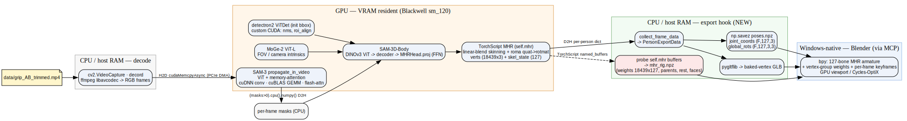
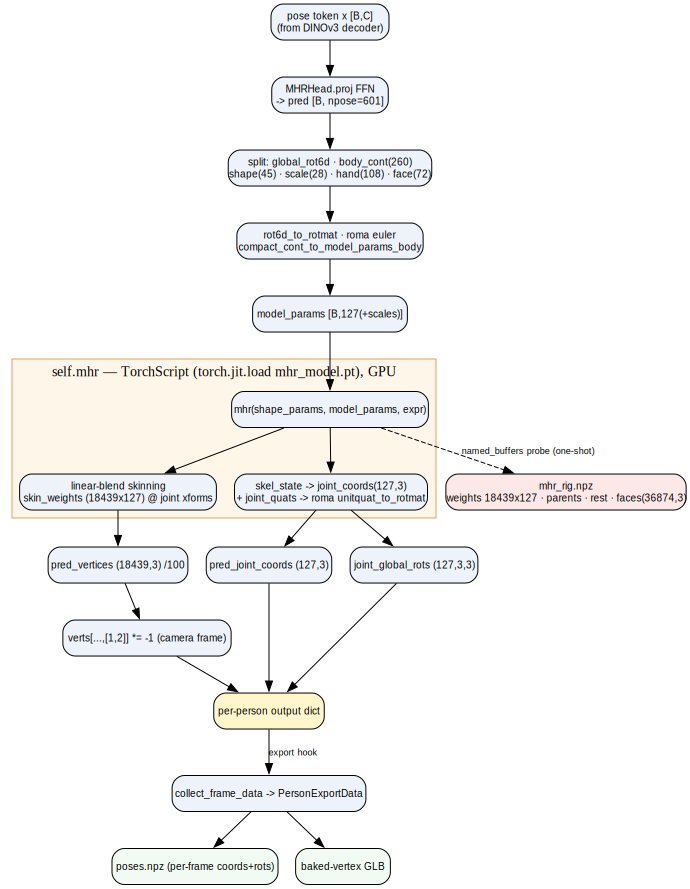

# SAM-Body4D Inference Pipeline — model & data-flow notes

> **Domain:** AI model inference — video → temporally-consistent 4D human mesh + 127-joint MHR pose
> **Status:** active · **Last updated:** 2026-06-08 · **Maintainer:** Claude + Thomas
> **Related:** [Windows GPU architecture](windows_gpu_architecture_notes.md) (where this compute runs) · [Dev environment & data flow](dev_environment_and_data.md)
> **Wiki-link demo (Obsidian/Foam only):** [[windows_gpu_architecture_notes]] · [[dev_environment_and_data]]
>
> **Verification legend:** `[V]` verbatim/observed in code · `[D]` documented by cited source · `[I]` inference · `[M]` verify on-machine.

## TL;DR
SAM-Body4D is a **training-free** pipeline that chains three pretrained model families — **SAM-3**
(video segmentation), **SAM-3D-Body** (per-frame 3D human mesh on the **MHR** body model), and
**Diffusion-VAS** (occlusion recovery, *disabled* for our clean single-subject clip) — plus **MoGe-2**
(FOV) and **detectron2 ViTDet** (initial human bbox). For our golf-grip task we run it to recover the
**real per-frame MHR mesh (18,439 verts) + 127-joint pose**, which we then retarget onto a Blender rig.

## End-to-end data flow

**Diagram**
- **source:** [B_pipeline.dot](assets/pipeline/B_pipeline.dot)
- **render:** [B_pipeline.svg](assets/pipeline/B_pipeline.svg)

Stages (per `scripts/offline_app.py`):
1. **Frame read** — `cv2.VideoCapture`/decord on CPU decodes RGB frames. `[V]` (`read_frame_at`, `offline_app.py:76`)
2. **Initial human detection** — `process_one_image(..., bbox_thr=0.6)` finds the first frame with a person
   and seeds a bbox. Uses **detectron2 ViTDet** under the hood. `[V]` (`offline_app.py:497-519`,
   `tools/build_detector.py`)
3. **SAM-3 mask propagation** — `predictor.propagate_in_video(...)` tracks the subject across all frames,
   emitting per-frame masks (thresholded `> 0.0`, moved to CPU). `[V]` (`on_mask_generation`,
   `offline_app.py:160-170`)
4. **MoGe-2 FOV** — `FOVEstimator(name='moge2')` estimates camera intrinsics. `[V]` (`offline_app.py:99`)
5. **SAM-3D-Body mesh recovery** — `process_image_with_mask(...)` runs per batch (`batch_size`, default 64;
   **16** for our 16 GB GPU): a **DINOv3 ViT** backbone → transformer decoder → **MHRHead**. `[V]`
   (`on_4d_generation` batch loop, `offline_app.py:443-477`)
6. **Diffusion-VAS occlusion recovery** — amodal seg + content completion; **off** for us
   (`completion.enable=false`). `[V]` (`offline_app.py:137-140`, `262`)
7. **Outputs** — rendered overlay MP4 + per-frame meshes; our **export hook** additionally taps poses + rig
   (see below).

## MHR head internals (where pose + rig live)

**Diagram**
- **source:** [D_mhr_internals.dot](assets/pipeline/D_mhr_internals.dot)
- **render:** [D_mhr_internals.svg](assets/pipeline/D_mhr_internals.svg)

`MHRHead.forward` (`models/sam_3d_body/.../mhr_head.py`):
- `proj` FFN emits `pred [B, npose=601]`, split into global rot (6D) + body pose (260 cont) + shape (45) +
  scale (28) + hands (108) + face (72). `[V]` (`mhr_head.py:283-317`, `npose` `:57-64`)
- `mhr_forward` assembles `model_params` and calls the **TorchScript MHR** `self.mhr(shape, model_params,
  expr)` → returns **skinned verts** + **skel state**; verts/100, joint coords/100, quats→rotmats via roma.
  `[V]` (`mhr_head.py:163-235`, `self.mhr = torch.jit.load(...)` `:114`)
- Camera-frame flip: `verts[..., [1,2]] *= -1` (and same for joints). `[V]` (`mhr_head.py:339-343`)
- Output dict keys: `pred_vertices` (18439,3), `pred_joint_coords` (127,3), `joint_global_rots` (127,3,3),
  `faces` (36874,3). `[V]` (`mhr_head.py:346-367`)

## Key facts to carry forward
- **Canonical MHR template:** 18,439 vertices / 36,874 faces — identical across frames; only pose changes. `[V]`
- **Export hook (ours):** accumulate per-frame `pred_joint_coords` + global rotations → `poses.npz`; dump the
  TorchScript MHR **skin weights (18439×127)** + parents + rest + faces → `mhr_rig.npz`. Key-name caveat:
  head emits `joint_global_rots` but `utils/mesh_export.collect_frame_data` reads `pred_global_rots` — verify
  at runtime. `[V]/[I]`
- **Compute placement:** all model forwards are GPU work flowing through the WSL2 GPU-PV stack — see
  [Windows GPU architecture](windows_gpu_architecture_notes.md). `[I]`
- **VRAM:** sequential stages + `batch_size=16` + completion off keep peak well under 16 GB. `[I]` (`[M]` to confirm)

## Code & source references
- `scripts/offline_app.py` — orchestration (detect `:497`, SAM-3 `:160`, batch HMR `:443`).
- `models/sam_3d_body/sam_3d_body/models/heads/mhr_head.py` — MHR head + TorchScript model.
- `utils/mesh_export.py` — `PersonExportData`, `collect_frame_data`, GLB exporter.
- Models · retrieved 2026-06-08 — SAM-3 [https://huggingface.co/facebook/sam3](https://huggingface.co/facebook/sam3) · SAM-3D-Body [https://huggingface.co/facebook/sam-3d-body-dinov3](https://huggingface.co/facebook/sam-3d-body-dinov3) · MoGe-2 [https://huggingface.co/Ruicheng/moge-2-vitl-normal](https://huggingface.co/Ruicheng/moge-2-vitl-normal); Diffusion-VAS `kaihuac/diffusion-vas-*` — see `scripts/setup.py`.
- Upstream repo · retrieved 2026-06-08 — [https://github.com/gaomingqi/sam-body4d](https://github.com/gaomingqi/sam-body4d) (this repo's origin lineage). `[D]`

## Open questions / to verify `[M]`
- Confirm the exact per-person dict keys returned by `process_image_with_mask` (global-rots naming).
- Confirm `self.mhr` TorchScript exposes skin weights/parents/rest as probeable buffers (the rig-dump risk).
- Measure real per-stage VRAM at `batch_size=16` on the RTX 5070 Ti.

## Changelog
- 2026-06-08 — Initial draft from a read of `offline_app.py` + `mhr_head.py` + `mesh_export.py`. Figures B
  (end-to-end) and D (MHR head) reused from the plan diagrams.
- 2026-06-08 — Model/upstream references converted to full-URL links per citation convention.
