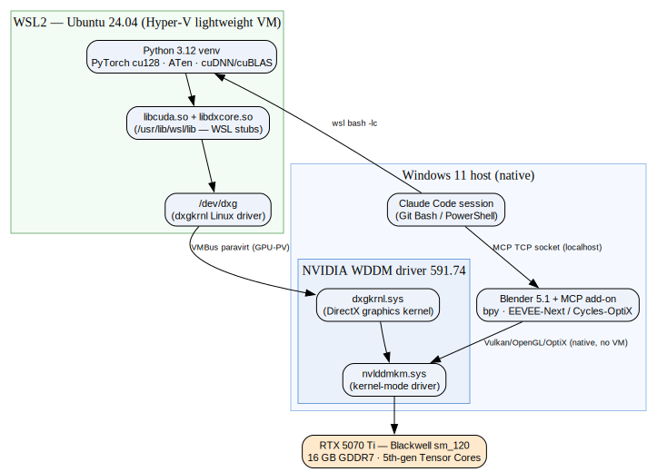
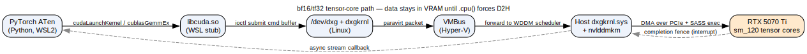

# Windows GPU Architecture Notes — WSL2 / CUDA / Blackwell

> **Domain:** GPU virtualization & CUDA execution on Windows 11 + RTX 5070 Ti
> **Status:** active · **Last updated:** 2026-06-08 · **Maintainer:** Claude + Thomas
> **Related:** [SAM-Body4D inference pipeline](sam_body4d_inference_pipeline.md) · [Dev environment & data flow](dev_environment_and_data.md) · project plan `~/.claude/plans/fluffy-coalescing-eclipse.md`
> **Wiki-link demo (Obsidian/Foam only):** [[sam_body4d_inference_pipeline]] · [[dev_environment_and_data]]
>
> **Verification legend:** `[V]` = verbatim-quoted from a cited primary source ·
> `[D]` = documented by the cited source (paraphrased) · `[I]` = my inference/reasoning, not yet doc-confirmed ·
> `[M]` = to be verified empirically on this machine.

## TL;DR
On Windows, a CUDA/Linux workload runs inside **WSL2**, but the GPU is still driven by the **Windows host
NVIDIA driver**. WSL2 does not have a native NVIDIA Linux kernel driver; instead CUDA user-space calls hit a
**stub `libcuda.so`** that forwards GPU work to the host driver via Microsoft's **GPU Paravirtualization
(GPU-PV)** over `/dev/dxg` + VMBus. This is NVIDIA's and Microsoft's officially supported path, and Docker
Desktop's GPU support rides the same backend. Two hard rules: **never install an NVIDIA Linux driver inside
WSL2**, and **verify the PyTorch build actually has `sm_120` kernels** before trusting the GPU.

---

## 1. The layered stack



**Diagram**
- **source:** [A_hw_stack.dot](assets/gpu/A_hw_stack.dot)
- **render:** [A_hw_stack.svg](assets/gpu/A_hw_stack.svg)

From top (Python) to bottom (silicon):

| Layer | Where | Role | Status |
|---|---|---|---|
| PyTorch / ATen + cuDNN/cuBLAS | WSL2 (Ubuntu) | Issues CUDA Runtime/Driver API calls | `[D]` |
| `libcuda.so` + `libdxcore.so` (`/usr/lib/wsl/lib`) | WSL2 | **Stub** driver libraries injected by WSL; translate CUDA/DX calls toward the host | `[V]` stub libcuda.so; `[M]` exact path |
| `/dev/dxg` (`dxgkrnl` Linux driver) | WSL2 kernel | Exposes the paravirtualized GPU device to Linux user space | `[D]` |
| VMBus (Hyper-V) | host↔guest | Transport that carries GPU commands out of the lightweight VM | `[D]` |
| `dxgkrnl.sys` + `nvlddmkm.sys` | Windows host | DirectX graphics kernel + NVIDIA kernel-mode driver; schedule + execute on the GPU | `[D]` |
| RTX 5070 Ti (Blackwell, `sm_120`, 16 GB GDDR7) | hardware | Runs SASS on the tensor/CUDA cores | `[V]` device present (`nvidia-smi`) |

Key documented facts:
- **It is real passthrough, not emulation.** Microsoft/NVIDIA built **GPU-PV (GPU Paravirtualization)**; the
  graphics kernel `dxgkrnl` marshals user-mode calls from the guest VM to the host kernel-mode driver. `[D]`
  — NVIDIA "Announcing CUDA on WSL 2" blog + Microsoft WSL GPU-compute docs (see Sources).
- **The Windows host driver is stubbed into WSL as `libcuda.so`.** `[V]` — *"The CUDA driver installed on
  Windows host will be stubbed inside the WSL 2 as `libcuda.so`"* (NVIDIA CUDA on WSL User Guide §4).
- **Existing Linux CUDA apps run unmodified** in WSL once the Windows driver is present. `[V]` — *"existing
  applications (compiled elsewhere on a Linux system for the same target GPU) can run unmodified within the
  WSL environment"* (NVIDIA CUDA on WSL User Guide §4).
- Docker confirms the same backend phrasing: GPU support needs *"drivers from NVIDIA supporting WSL 2 GPU
  Paravirtualization."* `[V]` — Docker Desktop GPU docs.

## 2. One GPU op — the per-call path



**Diagram**
- **source:** [C_gpu_op.dot](assets/gpu/C_gpu_op.dot)
- **render:** [C_gpu_op.svg](assets/gpu/C_gpu_op.svg)

A single `cudaLaunchKernel`/`cublasGemmEx` travels: ATen → `libcuda.so` stub → `/dev/dxg` ioctl →
VMBus → host `dxgkrnl.sys`/`nvlddmkm.sys` → GPU (DMA over PCIe + SASS on tensor cores) → completion
fence → async callback. `[D/I]` The added VMBus hop is the only structural difference from native Linux;
on-die compute throughput is identical, but it adds per-submission latency, so **batching matters** (favor
larger batches / fused kernels over many tiny launches). `[I]`

## 3. Hard rules & gotchas
1. **Do NOT install any NVIDIA GPU driver inside WSL2.** `[V]` — *"users must not install any NVIDIA GPU
   Linux driver within WSL 2"* and *"This is the only driver you need to install. Do not install any Linux
   display driver in WSL."* (NVIDIA CUDA on WSL User Guide §4 / §3.1). Installing one overwrites the
   `libcuda.so` stub and breaks GPU access.
2. **A CUDA *toolkit* (nvcc/headers) is separate from the driver and is optional.** Only needed to *compile*
   CUDA (e.g., building `detectron2`); pip-installed PyTorch ships its own CUDA runtime. Use the
   **WSL-Ubuntu** toolkit variant, which *"will not overwrite the NVIDIA driver that was already mapped into
   the WSL 2 environment."* `[V]` — NVIDIA CUDA on WSL User Guide §4.
3. **Keep the Windows host NVIDIA driver current** (it's the one doing the work). Current machine: driver
   591.74, reports CUDA 13.1 capability. `[M]` (from `nvidia-smi` this session).
4. **`nvidia-smi` works inside WSL2** via the passthrough — use it to confirm the GPU is visible in the VM. `[D]`

## 4. PyTorch on Blackwell (`sm_120`) — status + verification recipe
- Blackwell consumer GPUs are compute capability **`sm_120`** and require **CUDA 12.8+**. `[D]`
- As of late 2025, official **`sm_120` support in the *stable* PyTorch channel was still an open request**
  ([PyTorch issue #164342](https://github.com/pytorch/pytorch/issues/164342)); **nightly `cu128`**
  definitively includes `sm_120`. The stable channel *offers* a `cu128` wheel
  ([PyTorch Get Started](https://pytorch.org/get-started/locally/)), but whether a given stable wheel embeds `sm_120` SASS is
  **version-dependent and must be checked empirically** — do not assume. `[D/I]`
- **Verification recipe (run after install):** `[I]`
  ```python
  import torch
  print(torch.__version__, torch.version.cuda)
  print(torch.cuda.get_device_capability())   # expect (12, 0) for sm_120
  x = torch.randn(4096, 4096, device="cuda")
  print((x @ x).float().sum().item())         # must run without "no kernel image is available"
  ```
- **Fallback ladder:** stable `cu128` → if "no kernel image", `--pre ... /nightly/cu128` → last resort,
  build from source with `TORCH_CUDA_ARCH_LIST=12.0`. `[I]`

## 5. Docker Desktop alternative (same backend)
If we ever containerize the pipeline, the GPU path is unchanged:
- *"GPU support in Docker Desktop is only available on Windows with the WSL2 backend."* `[V]`
- Prereqs: NVIDIA GPU, current Windows, WSL2 GPU-PV drivers, latest WSL2 kernel (`wsl --update`), WSL2
  backend enabled. `[V]`
- Validate: `docker run --rm -it --gpus=all nvcr.io/nvidia/k8s/cuda-sample:nbody nbody -gpu -benchmark`. `[V]`
- Caveat for Claude Code's sandbox: *"`docker` is incompatible with the sandbox"* → exclude `docker *`. `[V]`

## 6. How this maps to our pipeline
The SAM-Body4D run executes in WSL2 (Linux-only deps: `decord`, `pyrender`, `detectron2`); all model
inference is GPU work flowing through the stack above. Blender runs **natively on Windows** and talks to the
host driver directly (no VM hop) for its viewport/Cycles-OptiX rendering. See the project plan for the
orchestration decision (where Claude Code itself runs). `[I]`

## 7. Open questions / to verify `[M]`
- Confirm `/usr/lib/wsl/lib/libcuda.so` exists and `ldd` of torch resolves to it (once WSL is up).
- Confirm the *installed* stable `cu128` torch reports `get_device_capability()==(12,0)`; if not, switch to nightly.
- Measure whether VMBus submission latency materially affects our batch sizes (likely negligible at `batch_size≥16`).

## 8. Sources
- NVIDIA — CUDA on WSL User Guide (§3.1, §4) · retrieved 2026-06-08 — [https://docs.nvidia.com/cuda/wsl-user-guide/index.html](https://docs.nvidia.com/cuda/wsl-user-guide/index.html)
- NVIDIA — Announcing CUDA on WSL 2 (GPU-PV/dxgkrnl mechanism) · retrieved 2026-06-08 — [https://developer.nvidia.com/blog/announcing-cuda-on-windows-subsystem-for-linux-2/](https://developer.nvidia.com/blog/announcing-cuda-on-windows-subsystem-for-linux-2/)
- Microsoft — Enable NVIDIA CUDA on WSL 2 · retrieved 2026-06-08 — [https://learn.microsoft.com/en-us/windows/ai/directml/gpu-cuda-in-wsl](https://learn.microsoft.com/en-us/windows/ai/directml/gpu-cuda-in-wsl)
- Docker — GPU support in Docker Desktop for Windows · retrieved 2026-06-08 — [https://docs.docker.com/desktop/features/gpu/](https://docs.docker.com/desktop/features/gpu/)
- PyTorch — Get Started (stable CUDA wheels incl. cu128) · retrieved 2026-06-08 — [https://pytorch.org/get-started/locally/](https://pytorch.org/get-started/locally/)
- PyTorch — Issue #164342 (sm_120 in stable) · retrieved 2026-06-08 — [https://github.com/pytorch/pytorch/issues/164342](https://github.com/pytorch/pytorch/issues/164342)

## 9. Changelog
- 2026-06-08 — Initial draft. Verified GPU-PV stack against NVIDIA/Microsoft/Docker docs; corrected an
  earlier overclaim that stable `cu128` definitely ships `sm_120` (now: verify-then-fallback). Added the
  "no Linux driver in WSL2" rule. Figures A (stack) and C (per-op path) rendered via Graphviz.
- 2026-06-08 — Normalized citations to full-URL link text; made inline PyTorch refs clickable.
