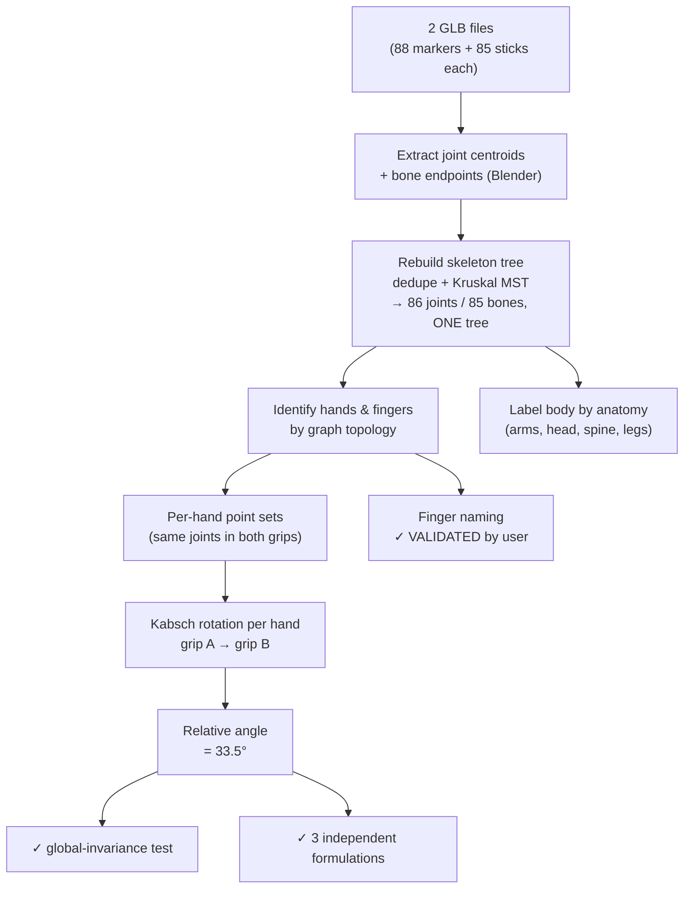
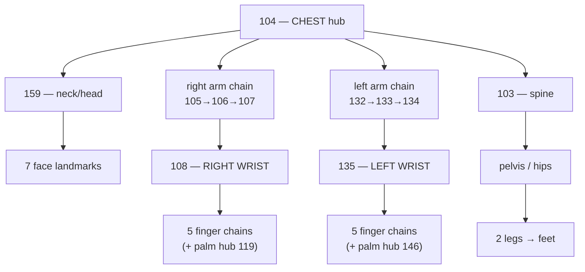

# Golf-Grip 3D Analysis — Status Report

**Project:** measure how your **right hand re-orients relative to your left hand** between two golf-grip techniques, from two Meta **SAM-3D-Body** GLB exports.
**Date:** 2026-06-07 · **Status:** ✅ **Fully validated** — rotation result, skeleton, **finger labels**, and **left/right** all confirmed. Remaining items are optional extensions (Section 6).

---

## 1. Headline result

> ## The right hand rotates **≈ 33.5°** relative to the left hand between grip A and grip B — about the club-shaft / vertical axis.


*Your right-hand skeleton in **grip A (red)** and **grip B (blue)**, after aligning both grips by the **left** hand, viewed straight down the rotation axis so the change shows as an in-plane turn. One hand moved (~39°), the other barely (~6°) — consistent with you changing only your right-hand grip.*

**Turntable (3D view of the same A-vs-B offset):**

<video src="renders/rotation_turntable.mp4" controls loop muted width="480" poster="renders/rotation_result.png"></video>

> ▶︎ If the video doesn't play inline, open **[renders/rotation_turntable.mp4](renders/rotation_turntable.mp4)** directly.

Your original guess was ~15°; the measured value is roughly **double** that. Details and the three independent cross-checks are in Section 5.

---

## 2. What we're working from

| | |
|---|---|
| **Inputs** | `gripA.glb`, `gripB.glb` — two single-image reconstructions from Meta's "Convert Body to 3D" demo, one per grip photo |
| **The catch** | The GLB has **no skeleton, no joint names, no skin, no metadata** — just **88 joint-marker spheres + 85 bone sticks** baked as plain geometry (`THREE.GLTFExporter`) |
| **So everything is *recovered*** | Joint positions = each marker's centroid; the rig = rebuilt from the bone sticks by graph topology |
| **Lucky break** | Both files use the **same marker ordering**, so marker *N* = the same joint in both grips → full point-to-point correspondence between the two grips |

---

## 3. The pipeline (what runs, in order)



Every stage is now validated.

---

## 4. ✅ VALIDATED — Skeleton recovery

The 85 bone sticks were snapped into **one clean tree of 86 joints** (a tree must have exactly *joints − 1* bones — it does). The structure is anatomically coherent:


*Front view of grip A. You're bent over a club: head/torso at top, both hands interlocked on the grip in the middle (the dense red cluster = all 10 fingers), legs/feet at the bottom.*

### Topology (proven by the graph)



Each wrist is a **degree-5 hub** with exactly **5 finger chains** — that's how we knew they're hands, independent of any naming.

### Confidence ledger (updated after your validation)

| Tier | Count | What | Basis |
|---|---|---|---|
| 🟢 **Certain / validated** | **48** | Wrists, chest, neck (topology) **+ all finger joints & palm hubs (you validated)** | Graph topology + your confirmation |
| 🟠 **Likely** | 27 | Shoulders, elbows, forearms, pelvis/hips, spine & leg joints | Role solid; exact joint inferred by position |
| 🔴 **Uncertain** | 11 | Individual face features (7), foot/leg extremities (4) | Region certain; specific landmark name not resolved |

*(Explore all 86 interactively — Section 9.)*

---

## 5. ✅ VALIDATED — The measurement

**Method.** Because marker *N* is the same joint in both grips, each hand is a point cloud with known correspondence between A and B. A **Kabsch (Procrustes) fit** gives each hand's rigid rotation from grip A→B; the right-vs-left *relative* change is the composition. We use only the **wrist + knuckle** region so curling fingers don't contaminate it.

**Why this is trustworthy:**

| Check | Result |
|---|---|
| Align by **left** hand, measure right residual | **33.5°** |
| Align by **right** hand, measure left residual | **33.5°** |
| Kabsch composition `Qₗ⁻¹·Qᵣ` | **33.5°** |
| Global-rotation invariance (rotate grip B randomly, re-measure) | unchanged to **0.0000°** |
| Per-hand motion | right ≈ **39°**, left ≈ **6°** (you changed only the right grip ✓) |
| Fit quality (Kabsch RMSD) | **1–7 mm** → hands behave as rigid bodies |
| Node-subset stability (full hand / palm-only / mid) | 33.5° / 35.7° / 35.1° |

> ⚠️ One method I tried — fitting coordinate frames by PCA — gave a wrong 70°. I traced it to PCA axis-swap instability on the near-static left hand and **discarded it**. The correspondence-based Kabsch methods (above) are the reliable ones and all agree.

**Net:** the magnitude **33.5° (±~2°)** is solid and does **not** depend on any finger naming or on which hand is left/right.

---

## 6. Status & remaining (optional) steps

| # | Step | Status |
|---|---|---|
| 1 | **Confirm finger identities** | ✅ **DONE** — validated by you, 2026-06-07 (thumbs + all 4 fingers, both hands) |
| 2 | **Certify left vs right** | ✅ **DONE** — your validation of the index→pinky order (which is handedness-dependent) confirms **node 108 = right hand**, 135 = left |
| 3 | Report the **signed direction** (which way the right hand turned, in golf terms) | ▶︎ **Ready to compute** — see Q1 in Section 8 |
| 4 | Optional: **per-grip absolute** right-vs-left orientation (not just the delta) | Now unblocked (validated hand frame exists) |
| 5 | Optional: rerun on **more grips / a video** for a trend | Pipeline reproducible offline (`analysis/README.md`) |

**Inherent caveats (not bugs):** each GLB is a *single-image* reconstruction, so a few degrees are model noise (bounded by the cross-checks).

---

## 7. ✅ VALIDATED — finger identities

You confirmed these on both hands. Colors: 🔴 thumb · 🟠 index · 🟡 middle · 🔵 ring · 🟣 pinky.

### Right hand (node 108)
**Four angles** (along X, Y, Z, isometric):


Single annotated view:


| finger ✓ | colour | joint chain (knuckle → tip) | # joints | attaches to |
|---|---|---|---|---|
| thumb | 🔴 | 127 → 128 → 129 → 130 → 131 | 5 | palm hub 119 |
| pinky | 🟣 | 110 → 111 → 112 → 113 → 114 | 5 | wrist 108 |
| ring | 🔵 | 115 → 116 → 117 → 118 | 4 | wrist 108 |
| middle | 🟡 | 120 → 121 → 122 | 3 | palm hub 119 |
| index | 🟠 | 123 → 124 → 125 → 126 | 4 | wrist 108 |

### Left hand (node 135)
**Four angles** (along X, Y, Z, isometric):


Single annotated view:


| finger ✓ | colour | joint chain (knuckle → tip) | # joints | attaches to |
|---|---|---|---|---|
| index | 🟠 | 137 → 138 → 139 → 140 → 141 | 5 | wrist 135 |
| middle | 🟡 | 142 → 143 → 144 → 145 | 4 | wrist 135 |
| ring | 🔵 | 147 → 148 → 149 | 3 | palm hub 146 |
| pinky | 🟣 | 150 → 151 → 152 → 153 | 4 | wrist 135 |
| thumb | 🔴 | 154 → 155 → 156 → 157 → 158 | 5 | palm hub 146 |

The full rig is now named end-to-end (body + both wrists + all 10 fingers). The interactive viewer and all renders reflect these confirmed labels.

---

## 8. Open questions for you

1. **Signed direction (golf semantics):** want me to express the 33.5° as a golf concept — e.g. "the right hand rotated X° toward a **stronger** (or **weaker**) grip" — and state the turn direction about the shaft? *(Now computable since L/R and the fingers are locked.)*
2. **Scope:** stop at this single A-vs-B number, or do you want (a) the per-grip **absolute** right-vs-left orientations, and/or (b) a **multi-grip / video** trend?

---

## 9. Assets & how to reproduce

| Asset | Path |
|---|---|
| Interactive 3D viewer (orbit + hover all 88 points) | `glb_joint_viewer/index.html` |
| This report | `glb_joint_viewer/STATUS_REPORT.md` |
| Rotation result image / video | `renders/rotation_result.png` · `renders/rotation_turntable.mp4` |
| Skeleton overview | `renders/skeleton_overview_annotated.png` |
| Annotated hands (validated) | `renders/{right,left}_hand_4views.png` · `..._annotated.png` |
| Full pipeline (scripts + data + reproduce instructions) | `glb_joint_viewer/analysis/` (+ its `README.md`) |

**Relaunch the live viewer:**
```bash
python3 -m http.server 8731 --directory <repo>/glb_joint_viewer
# then open http://127.0.0.1:8731
```

**Re-run the measurement offline:**
```bash
cd <repo>/glb_joint_viewer/analysis && bash restore_to_tmp.sh
python3 /tmp/crosscheck2.py      # → 33.5°, three ways
```

---

## 10. Gallery — all renderings

### Headline rotation result


### Turntable (video)
<video src="renders/rotation_turntable.mp4" controls loop muted width="480" poster="renders/rotation_result.png"></video>

> ▶︎ Direct link: **[renders/rotation_turntable.mp4](renders/rotation_turntable.mp4)**

### Recovered skeleton (confidence-colored)


### Right hand — 4 views (X / Y / Z / isometric)


### Left hand — 4 views (X / Y / Z / isometric)


### Right hand — single annotated view


### Left hand — single annotated view


### Supporting raw renders
Both hands, red = right / blue = left (raw, unlabeled):


Full grip-A skeleton, unlabeled:


Right-hand A-vs-B overlay, raw (top & front, before annotation):


